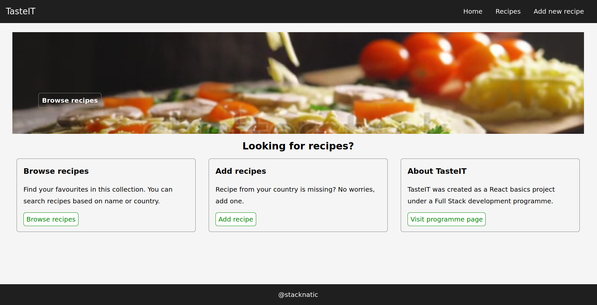

# Recipe App

Final task for react basics course.

The app is a single page recipe web app that allows users to add and browse recipes from all around the world.

## Tech Stack

The app uses React Js for the frontend and Django restframework for the back end. 

## Installation

- git clone or download

- do 'npm install' to install dependencies.

If you are not using the live demo at recipes.stacknatic.com, it is necessary to modify the endpoint. Do the following:

- start json server with 'npm run server'

- modify axios endpoint to the following 'http://localhost:3015/posts/

## Features

- Navigate between pages

- Add recipes

- Browse recipes

### Screenshot
.

Live demo: [recipes](https://recipes.stacknatic.com).

